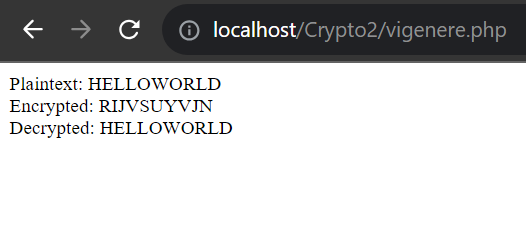

# Kriptografi
# Vigenere Cipher
## Enkripsi-Dekripsi
<body>
    <table border="1">
        <tr>
            <th> Nama</th>
            <th>NIM</th>
            <th>Kelas</th>
        </tr>
        <tr>
            <td>Rezza Fauzi</td>
            <td>312110133</td>
            <td>TI.21.A.1</td>
        </tr>
    </table>
</body>

## CodingaN

```php
<?php

// Fungsi untuk mengenkripsi pesan dengan Vigenere Cipher
function vigenereEncrypt($plainText, $key) {
    $keyLength = strlen($key);
    $encryptedText = '';

    for ($i = 0; $i < strlen($plainText); $i++) {
        $char = $plainText[$i];
        $keyChar = $key[$i % $keyLength];

        $encryptedChar = chr(((ord($char) + ord($keyChar)) % 26) + ord('A'));
        $encryptedText .= $encryptedChar;
    }

    return $encryptedText;
}

// Fungsi untuk mendekripsi pesan yang dienkripsi dengan Vigenere Cipher
function vigenereDecrypt($encryptedText, $key) {
    $keyLength = strlen($key);
    $decryptedText = '';

    for ($i = 0; $i < strlen($encryptedText); $i++) {
        $char = $encryptedText[$i];
        $keyChar = $key[$i % $keyLength];

        $decryptedChar = chr(((ord($char) - ord($keyChar) + 26) % 26) + ord('A'));
        $decryptedText .= $decryptedChar;
    }

    return $decryptedText;
}

$key = "KUNCIKU";  // Ganti dengan kunci Vigenere Anda sendiri
$plainText = "Hello Guys";
$encryptedText = vigenereEncrypt(strtoupper($plainText), $key);
$decryptedText = vigenereDecrypt($encryptedText, $key);

echo "Plaintext: " . $plainText . "<br>";
echo "Encrypted: " . $encryptedText . "<br>";
echo "Decrypted: " . $decryptedText . "<br>";

?>

```

## Penjelasan

1. Vigenere Cipher: Kodingan ini menggunakan metode Vigenere Cipher untuk mengenkripsi
dan mendekripsi pesan. Vigenere Cipher adalah metode substitusi sederhana yang
menggabungkan penggunaan kata kunci (key) dengan teks pesan untuk menghasilkan teks
terenkripsi.
2. Fungsi vigenereEncrypt: Fungsi ini digunakan untuk mengenkripsi pesan. mengambil dua
parameter, yaitu teks pesan yang akan dienkripsi dan kata kunci (key) yang akan digunakan
dalam proses enkripsi. Fungsi ini melakukan perulangan karakter per karakter dalam teks
pesan dan menggunakan rumus Vigenere Cipher untuk menghasilkan karakter terenkripsi.
Hasil enkripsi disimpan dalam variabel $encryptedText.
3. Fungsi vigenereDecrypt: Fungsi ini digunakan untuk mendekripsi pesan yang telah
dienkripsi dengan menggunakan Vigenere Cipher. dan mengambil dua parameter, yaitu teks
terenkripsi dan kata kunci (key). Fungsi ini mirip dengan fungsi vigenereEncrypt, tetapi
melakukan operasi dekripsi untuk mengembalikan pesan asli. Hasil dekripsi disimpan dalam
variabel $decryptedText.
4. Penggunaan strtoupper: Sebelum mengenkripsi teks pesan, kodingan menggunakan
strtoupper untuk mengonversi teks pesan ke huruf besar (uppercase). Ini dilakukan untuk
memastikan bahwa teks pesan yang akan dienkripsi dan dekripsi berada dalam huruf besar.
5. Tampilan Hasil: Kodingan mencetak teks pesan asli, teks terenkripsi, dan teks terdekripsi ke
layar menggunakan pernyataan echo.
6. Key: Kata kunci (key) yang digunakan dalam kodingan ini adalah "KUNCIKU".


# Output


## Done

# Panjang Umur Untuk Semua Hal-Hal Baik
